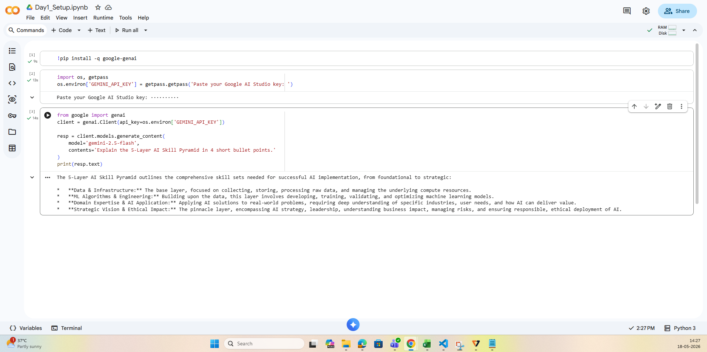
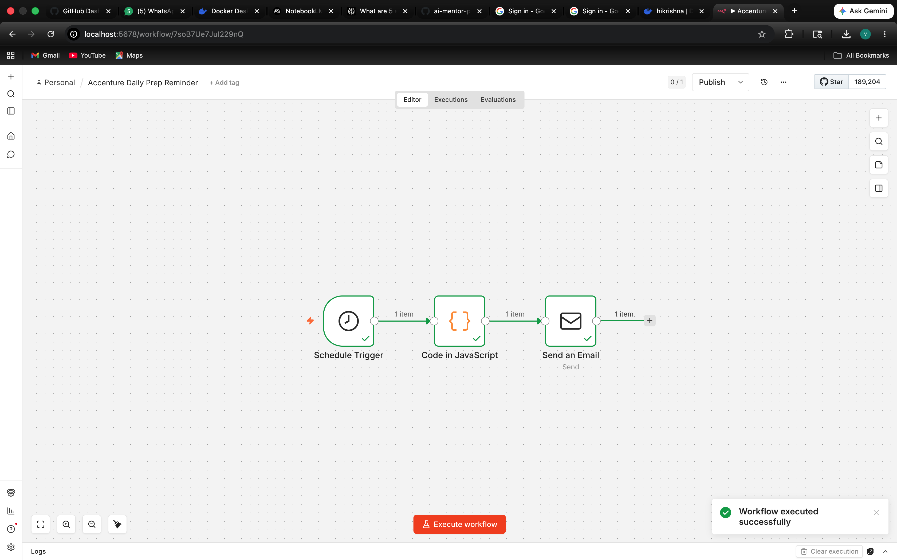

# AI Mentor Bootcamp — venkatakrishna

Public portfolio of 12-day AI Trainer Workshop. By Day 12: 6 daily notebooks + capstone Streamlit URL.

---

## Day 1 – Setup complete

-  Google AI Studio API key provisioned
-  Groq API key provisioned
-  Hello-Gemini call working – see [Day1_Setup.ipynb](Day1_Setup.ipynb)

### Screenshot

---

## Day 2 – Resume Extractor + Six Patterns

-  Built resume extractor – see [Day2b_ResumeExtractor.ipynb](Day2_ResumeExtractor.ipynb)
-  Completed six prompting patterns – see [Day2a_SixPatterns_krishna.ipynb](Day2_SixPatterns_krishna.ipynb)

---

## Day 3 – AI Policy + Verification

-  Drafted AI usage policy – see [Day3_AI_Policy.md](Day3_AI_Policy.md)
-  Policy exported as PDF – see [Day3_AI_Policy.pdf](Day3_AI_Policy.pdf)
-  Verification exercise complete – see [Day3_Verification.md](Day3_Verification.md)

---

## Day 4A — Productivity sprint

**Company:** Accenture
**Time:** 45 minutes (timeboxed)

-  Placement brief – see [Accenture_brief.pdf](Accenture_brief.pdf)
-  Placement deck – see [Accenture_deck.pdf](Accenture_deck.pdf)

### Edit notes (3 lines)

1. Gamma had "Accenture 2024–25" on the cover slide —
   corrected to 2025–26.
2. Gamma merged Coding + Communication into one round —
   split them into two separate elimination rounds as per
   Perplexity data.
3. Gamma confabulated "$3B AI investment" stat on Slide 6 —
   replaced with [verify with Accenture] since it wasn't
   in any cited source.

   ## Day 4B — n8n Automation Workflow

-  n8n self-hosted via Docker
-  Built daily Accenture prep tip emailer
-  Workflow: Schedule Trigger → Code → Send Email
- 
